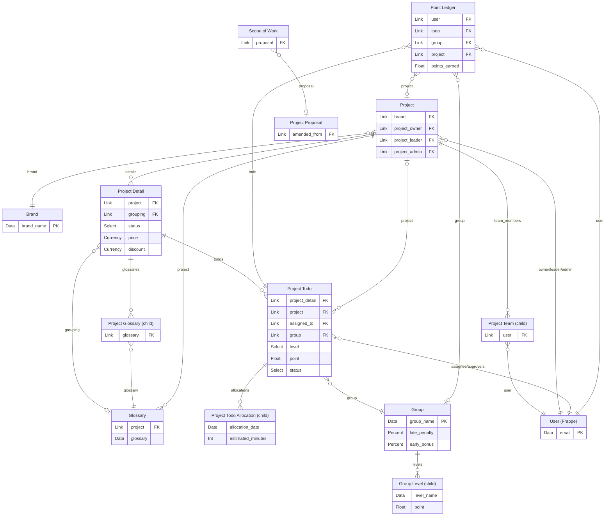

# Vernon Project — Entity-Relationship Diagram

All 14 DocTypes and their Link / child-table relationships, generated from the DocType JSON.
Rendered version: [`docs/erd.html`](erd.html). Field-by-field reference: [`docs/doctypes.html`](doctypes.html).

Crow's-foot: `||` exactly one · `o{` zero-or-many · `o|` zero-or-one. Child-table DocTypes
(`istable: 1`) are reached only through their parent's Table field.

## Notes

- **Project Todo is standalone.** It links its parent via `project_detail` (earlier it was a `todo`
  child table) and owns the `allocations` child table for per-day planning.
- **Brand** replaces the former **Customer** DocType.
- **Scoring** runs through Group → Group Level (`level`/`point`) with awards recorded in Point Ledger.
